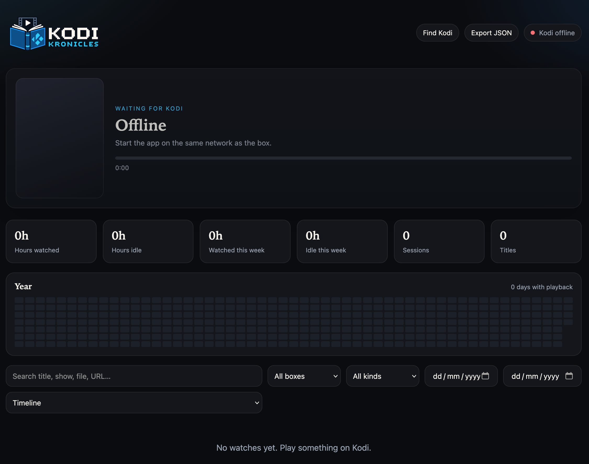

<p align="center">
  
</p>

<p align="center">
   
</p>

A small Go app that sits on your network and keeps a journal of everything you watched on kodi.

## Build & Run

```bash
cd kodi-kronicles
go mod tidy
go build -o kodi-kronicles ./cmd/kodi-kronicles
./kodi-kronicles
```

Open http://localhost:8088, tap **Find Kodi**, pick your kodi box. That box is saved in `data/kodi-targets.json` for the next start.

```bash
./kodi-kronicles -listen :8088 -data-dir ./data
./kodi-kronicles -kodi-host 192.168.1.10 -kodi-user xbmc -kodi-pass secret
```


## Flags

`./kodi-kronicles -h`

| Flag | Default | Meaning |
| --- | --- | --- |
| `-listen` | `:8088` | Web UI address |
| `-data-dir` | `./data` | SQLite + posters + saved boxes |
| `-kodi-host` | *(empty)* | Box IP; empty = last saved / UI discover |
| `-kodi-http-port` | `8080` | Kodi JSON-RPC HTTP |
| `-kodi-ws-port` | `9090` | Kodi JSON-RPC WebSocket |
| `-kodi-user` | *(empty)* | HTTP basic auth user |
| `-kodi-pass` | *(empty)* | HTTP basic auth password |
| `-kodi-tls` | `false` | Use https/wss |
| `-poll-interval` | `3s` | Now-playing refresh |
| `-min-watch-secs` | `15` | Drop shorter plays |
| `-min-idle-secs` | `30` | Drop shorter idle gaps |
| `-poster-max-w` | `400` | Max stored poster width |
| `-poster-max-h` | `600` | Max stored poster height |
| `-poster-quality` | `82` | JPEG quality |


## Screenshots

<p align="center">
  
</p>

